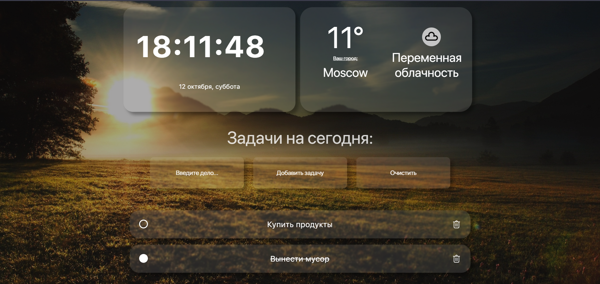

## Приложение My-momentum

[Ссылка на деплой](https://daniltro.github.io/my-momentum-app/)

- Отображает погоду (вашу погоду по геолокации или того города, который выберете)
- Отображает время и дату
- Позволяет вести список дел (а также отмечать выполненными и удалять их)
- Фоновое изображение меняется в соответствии с временем суток (утро/день/вечер/ночь)

### Инструкция по запуску
- Создайте папку для проекта и перейдите в неё.
- Склонируйте репозиторий `git clone git@github.com:daniltro/my-momentum-app.git`
- Установите зависимости `npm install`
- Запускайте проект `npm run dev`
---
В файле `src/components/weather/WeatherServices.js` есть флаг useFakeData который позволяет не использовать реальные запросы к апи для тестирования (используется бесплатное апи и количество ежемесячных запросов к сожалению ограничено)
